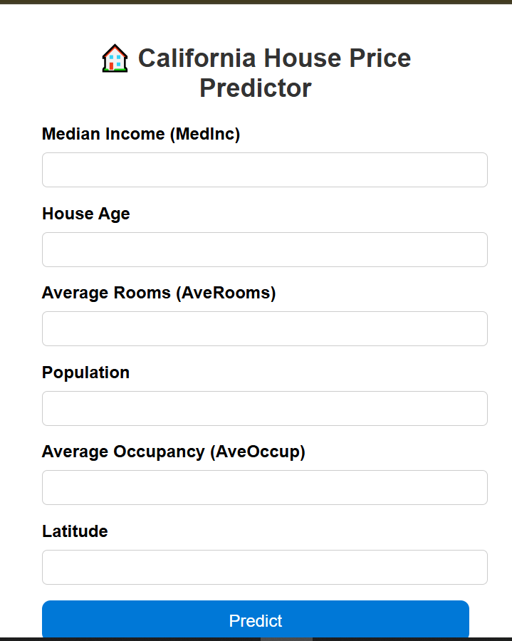

### California_Housing

### Software and Tools Required

1. [GithubAccount](https://github.com)
2. [RenderAccount](https://dashboard.render.com/)
3. [VSCodeIDE](https://code.visualstudio.com/)
4. [GitCLI](https://cli.github.com/)


Create a New Environment

'''
python -m venv ml_env
'''

🏠 California House Price Predictor

A Machine Learning Web Application built using Flask that predicts California housing prices based on various input parameters such as Median Income, House Age, Average Rooms, and more.

## 🚀 Live Demo

[Click here to visit the deployed app](https://california-housing-iooz.onrender.com)

---

## 🖼️ App Interface



---

🧠 Overview

This project demonstrates how machine learning models can be deployed as web applications.
The app takes input values from users, passes them through a trained regression model, and returns the predicted house price instantly.

---

## ⚙️ How It Works
1. Enter the required values like Median Income, House Age, etc.  
2. Click **Predict** to get the estimated house price.  
3. The app uses a trained regression model based on the California housing dataset.

---

## 🧩 Tech Stack
- **Frontend:** HTML, CSS  
- **Backend:** Flask (Python)  
- **Model:** Scikit-learn  
- **Deployment:** Render Platform  

---

## 💡 Developer Notes
This project demonstrates how to:
- Train and save a regression model using `pickle`
- Serve predictions via a Flask API
- Deploy the app on Render with CI/CD pipeline
 
---
### 🗂️ Project Structure

```
California-House-Price-Predictor/
│
├── app.py                       → Flask web app entry point  
├── .gitignore                   → Files & folders Git should ignore  
├── Dockerfile                   → To containerize your app  
├── LICENSE                      → License information  
├── Linear Regression ML Implemention.ipynb  → Model training notebook  
├── procfile                     → Command for Render/Heroku to run app  
├── README.md                    → Documentation for your repo  
├── regmodel.pkl                 → Trained Linear Regression model  
├── scaler.pkl                   → StandardScaler object  
├── requirements.txt             → Python dependencies  
│
├── .github/                     → GitHub Actions (CI/CD) configuration  
│   └── workflows/  
│       └── deplo.yml            → Auto-deploy pipeline to Render  
│
├── templates/                   → HTML files for Flask  
│   └── Home.html                → User interface page  
│
├── static/                      → (Optional) CSS/JS files folder  
│
└── img/                         → Images for documentation  
    └── mlapp.PNG                → Screenshot of your app
```
---
## 🚀 How to Run Locally

### 1️⃣ Clone the Repository
```bash
git clone https://github.com/vuduthuri12/California_Housing.git
cd California_Housing
```

### 2️⃣ Create a Virtual Environment
```bash
python -m venv venv
venv\Scripts\activate     # On Windows
# OR
source venv/bin/activate  # On macOS/Linux
```

### 3️⃣ Install Dependencies
```bash
pip install -r requirements.txt
```

### 4️⃣ Run the Flask App
```bash
python app.py
```

### 5️⃣ Visit the App
Open your browser and go to:
```
http://127.0.0.1:5000/
```

---

## 🔁 CI/CD Workflow

- Any **push to `main`** automatically triggers GitHub Actions.  
- The workflow file located at:
  ```
  .github/workflows/deplo.yml
  ```
  handles automatic deployment to **Render** using the Render Deploy Hook.

---

## 🧰 Model Details

- **Algorithm:** Linear Regression  
- **Dataset:** California Housing Dataset (from Scikit-learn)  
- **Preprocessing:** StandardScaler  
- **Evaluation Metrics:** R² Score and Residual Analysis  

---

## 📄 License

This project is licensed under the **MIT License**.

---
